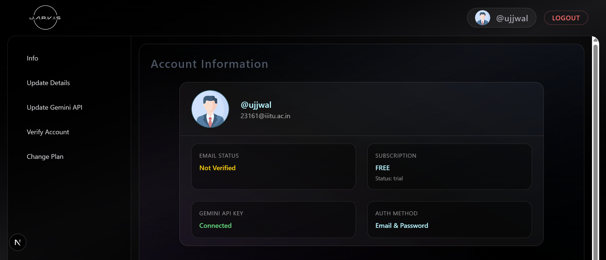

# 🤖 JARVIS — AI-Powered Browser Automation Assistant

Jarvis is an **AI-powered assistant** that understands **natural language commands** and performs **real browser actions** such as filling forms, clicking buttons, scanning pages, and extracting data.

The project is structured as a **monorepo** containing:
- 🌐 A web interface
- 🧩 A Chrome extension
- ⚙️ A backend AI + execution engine

---

## 📂 Project Structure

```
JARVIS/
│
├── jarvis/          # Chrome Extension (Browser Automation Layer)
│
├── jarvis-backend/  # Backend (AI + Task Execution Engine)
│
├── jarvis-web/      # Web Interface (Frontend UI)
│
└── README.md        # Project Documentation
```

---

## 🧠 How Jarvis Works

1. User provides a **natural language task**
2. Backend:
   - Identifies the task category
   - Generates executable instructions
3. Chrome Extension:
   - Scans the page or browser history (if required)
   - Executes DOM actions on the active tab
4. Results are returned and displayed in real-time logs

---

## 🧩 `jarvis/` — Chrome Extension

**Purpose**  
Executes browser-level actions safely on the active tab.

**Key Features**
- DOM scanning
- Input filling
- Button clicking
- Page & browser history scanning
- Secure background execution

**Tech Stack**
- Chrome Extension APIs
- Content Scripts
- Background Service Workers
- JavaScript

### Load the Extension
- Open chrome://extensions
- Enable "Developer mode"
- Click "Load unpacked"
- Select the jarvis/ folder


---

## ⚙️ `jarvis-backend/` — Backend Engine

**Purpose**  
Handles AI reasoning and converts tasks into executable instructions.

**Responsibilities**
- Task classification
- Instruction generation
- Selector & action planning
- Controlled execution logic

**Tech Stack**
- Node.js
- Express
- AI Model Integration
- REST APIs

### Run Backend
```bash
cd jarvis-backend
npm install
npm run dev
```
Backend runs on: http://localhost:8000

---

## 🌐 `jarvis-web/` — Web Interface

**Purpose**  
Provides a clean and modern UI to interact with Jarvis.

**Features**
- Natural language input
- Real-time execution logs
- Generated function preview
- Detected task category display

**Tech Stack**
- React
- Tailwind CSS
- Fetch API

### Run Frontend
```bash
cd jarvis-web
npm install
npm run dev
```



---

## 🚀 Getting Started

To run the entire Jarvis system:

1. **Clone the repository:**
   ```bash
   git clone <repository-url>
   cd jarvis
   ```

2. **Set up the Backend:**
   ```bash
   cd jarvis-backend
   npm install
   npm run dev
   ```

3. **Set up the Web Interface:**
   ```bash
   cd ../jarvis-web
   npm install
   npm run dev
   ```

4. **Load the Chrome Extension:**
   - Open `chrome://extensions`
   - Enable "Developer mode"
   - Click "Load unpacked"
   - Select the `jarvis/` folder

5. **Access the Application:**
   - Web UI: Open your browser and go to the development server URL (usually http://localhost:3000)
   - Ensure the backend is running on http://localhost:8000

---

## 🔐 Security & Design Philosophy

- No unsafe eval execution
- Strict message passing between backend and extension
- Page access only via content scripts
- Controlled and categorized task execution

---

## 🚀 Key Capabilities

- Fill forms automatically
- Click buttons intelligently
- Extract data from web pages
- Scan browser history
- Perform multi-step workflows
- Natural language → DOM actions

---

## 📌 Example Commands

- "Fill the login form with my email and password"
- "Click the submit button"
- "Scan this page and summarize it"
- "Find my last visited GitHub repository"

---

## 🛠️ Future Roadmap

- Voice command support
- Multi-tab automation
- Task memory & history
- Visual selector highlighting
- Cloud-based sync
- Smarter multi-step planning

---

## 👨‍💻 Author

Ujjwal Kumar  
B.Tech CSE  
Full-Stack Developer  
MERN • Next.js • Chrome Extensions • AI Systems

---

## 🤝 Contributing

Contributions are welcome! Please feel free to submit a Pull Request.

1. Fork the project
2. Create your feature branch (`git checkout -b feature/AmazingFeature`)
3. Commit your changes (`git commit -m 'Add some AmazingFeature'`)
4. Push to the branch (`git push origin feature/AmazingFeature`)
5. Open a Pull Request
